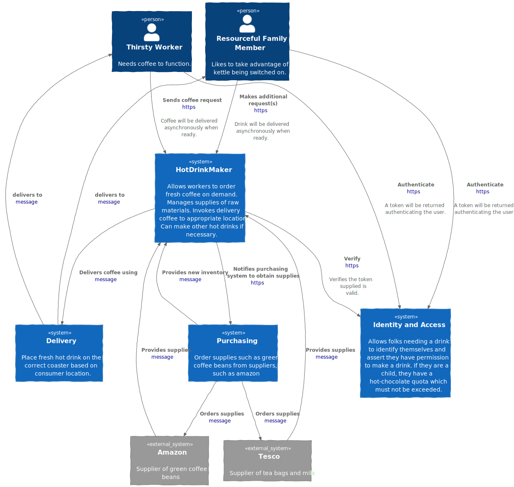

# Test-driven coffee

Exploring state of the tdd-verse in the context of a model of my
morning coffee making ritual.

The overall system being modelled is shown below.

- The systems in blue denote the core domain and separate sub domains
  modelled in this project.
  - The HotDrinkMaker is the core domain.
  - Delivery is a supporting sub domain.
  - Purchasing and iam are generic subdomains.
- The HotDrinkMaker is responsible for taking orders for hot drinks,
  producing the beverages, and passing them on to the delivery service
  to be taken to the consumer.
- The Purchasing subdomain is responsible for repleneshing the inventory
  with delicious coffee making supplies.
- The Delivery subdomain modelstaking hot drinks to the appropriate
  location for forthwith consumption.
- The IAM subdomain manages authentication and authorization.
  
Typically, the ThirstyWorker will be the main consumer and will make
spontaneous orders for hot drinks.  On occasion, a
ResourcefulFamilyMember may notice a hot drink is being made and will
ask for their own drink at the same time.  It is rare that a family
memeber will start the drink making process and supply the
ThirstyWorker with coffee.  Children are only allowed a certain number
of hot-chocolates a day and this must be enforeced by the business
logic.

## Architecture

The architecture of the coffee making system is described [here](./arch/ARCHITECTURE.md)

## Starting the system

TODO

## Running the simulation

TODO
